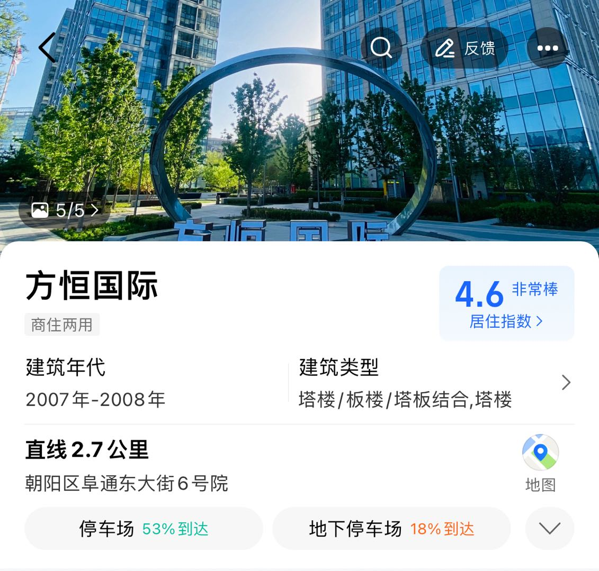
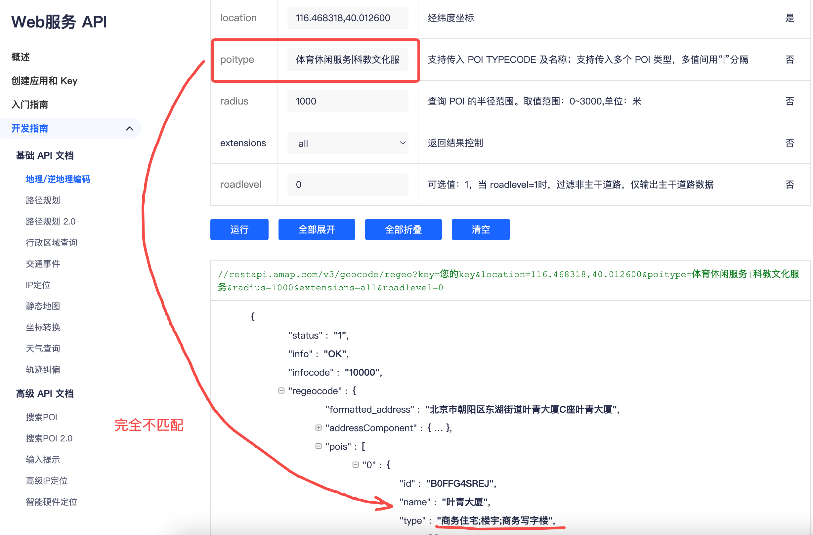
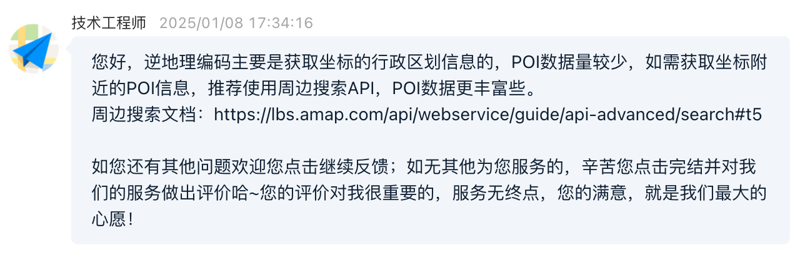

# 高德WEB服务API

基于[高德WEB服务API](https://lbs.amap.com/api/webservice/summary)进行位置追踪。

- [高德WEB服务API](#高德web服务api)
  - [地理编码(地址--\>经纬度):](#地理编码地址--经纬度)
  - [逆地理编码(经纬度--\>地址)](#逆地理编码经纬度--地址)
    - [注意事项--地址解释:](#注意事项--地址解释)
    - [注意事项--不要通过逆地理编码获取POI:](#注意事项--不要通过逆地理编码获取poi)
  - [搜索POI 2.0:](#搜索poi-20)
  - [项目运行:](#项目运行)


## 地理编码(地址-->经纬度):

只有 **[经纬度生成](demo/geo_ex.py)** 后，才能使用逆地理编码获取POI信息。

POI（Point of Interest 兴趣点）通常是某个具体的位置，比如一个餐厅、一座商场。

AOI（Area of Interest 兴趣区域）是更大的区域范围，比如一个小区、一片公园、一块商圈。

文件运行:

```bash
python demo/geo_ex.py 
```

输出示例，返回字段中的 `location` 即经纬度:

```txt
地理编码结果：
{'status': '1', 'info': 'OK', 'infocode': '10000', 'count': '2', 'geocodes': [{'formatted_address': '北京市朝阳区阜通东大街6号', 'country': '中国', 'province': '北京市', 'citycode': '010', 'city': '北京市', 'district': '朝阳区', 'township': [], 'neighborhood': {'name': [], 'type': []}, 'building': {'name': [], 'type': []}, 'adcode': '110105', 'street': '阜通东大街', 'number': '6号', 'location': '116.482086,39.990496', 'level': '门址'}, {'formatted_address': '北京市朝阳区阜通东大街6号院', 'country': '中国', 'province': '北京市', 'citycode': '010', 'city': '北京市', 'district': '朝阳区', 'township': [], 'neighborhood': {'name': [], 'type': []}, 'building': {'name': [], 'type': []}, 'adcode': '110105', 'street': '阜通东大街', 'number': '6号院', 'location': '116.482145,39.990039', 'level': '门址'}]}

地理编码结果：
{'status': '1', 'info': 'OK', 'infocode': '10000', 'count': '1', 'geocodes': [{'formatted_address': '北京市朝阳区东湖街道叶青大厦c座', 'country': '中国', 'province': '北京市', 'citycode': '010', 'city': '北京市', 'district': '朝阳区', 'township': [], 'neighborhood': {'name': [], 'type': []}, 'building': {'name': [], 'type': []}, 'adcode': '110105', 'street': [], 'number': 'c座', 'location': '116.468318,40.012600', 'level': '门址'}]}
```


## 逆地理编码(经纬度-->地址)

### 注意事项--地址解释:

针对经纬度 "116.482145,39.990039"，对应的具体门牌号信息为 "北京市朝阳区阜通东大街6号"，更容易理解的地址为 "北京市朝阳区望京街道方恒购物中心方恒国际"。



### 注意事项--不要通过逆地理编码获取POI:

不要通过逆地理编码获取POI，非常不准:



官方建议通过[搜索POI 2.0](https://lbs.amap.com/api/webservice/guide/api-advanced/newpoisearch#t4)获取POI:




## 搜索POI 2.0:

搜索POI 2.0即为项目主文件，可通过常规FastAPI文件启动方式启动服务进行测试。

[POI分类编码](poi_server/poi_search_v2.py#28)可参考高德官方自定义修改。


## 项目运行:

创建`env_config/.env.local`填入高德地图 API 的密钥，例如:

```conf
# 高德地图 API 的密钥
GAODE_API_KEY="你的密钥"
```

1. **运行服务**：

```bash
uvicorn main:app --reload
```

2. **访问接口**：

服务运行后，访问 `http://127.0.0.1:8000/docs`，可以使用 Swagger UI 测试接口。

3. **请求示例**：

向 `/search_poi/` 发送 POST 请求，示例 JSON 数据：

示例--北京市朝阳区东湖街道叶青大厦c座的经纬度

```json
{
    "location": "116.468318,40.012600"
}
```

🚨经度和纬度用","分割，经度在前，纬度在后，经纬度小数点后不得超过6位。

4. **返回结果**：

返回的数据会是 POI 搜索结果（转换后的格式）。如果失败，将返回错误信息。

示例--北京市朝阳区东湖街道叶青大厦c座周边POI

```json
{
    "酒吧": [
        "CLUB禾·高空观景西餐厅"
    ],
    "中餐厅": [
        "望京一号(博雅店)",
        "俄士厨房(北京望京万象汇店)",
        "黄记煌三汁焖锅(望京万象汇店)"
    ],
    "普通商场": [
        "北京望京万象汇"
    ],
    "上海菜": [
        "老吉堂上海本帮菜(望京店)"
    ],
    "购物中心": [
        "望京华彩商业中心"
    ],
    "潮州菜": [
        "潮粥荟·潮汕砂锅粥(望京万象汇店)"
    ],
    "综合酒楼": [
        "香丰阁(望京店)"
    ],
    "云贵菜": [
        "费大厨辣椒炒肉(北京望京万象汇店)"
    ],
    "餐饮相关": [
        "北京望京华彩智选假日酒店",
        "拾也烤肉放题(望京万象汇店)"
    ],
    "麦当劳": [
        "麦当劳(广顺北大街餐厅)"
    ],
    "火锅店": [
        "海底捞火锅(望京万象汇店)"
    ],
    "海鲜酒楼": [
        "香丰渔港蒸汽海鲜·川湘菜(望京店)"
    ],
    "日本料理": [
        "将太无二(北京望京万象汇餐厅)"
    ],
    "特色/地方风味餐厅": [
        "很久以前羊肉串(北京望京万象汇店)"
    ],
    "培训机构": [
        "新东方国际教育·雅思托福(望京华彩校区)"
    ],
    "电影院": [
        "新影联·华谊兄弟电影中心"
    ],
    "外国餐厅": [
        "比格比萨自助(望京万象汇店)"
    ],
    "四川菜(川菜)": [
        "江边城外烤全鱼(望京万象汇店)"
    ],
    "KTV": [
        "T-ONE KTV同乐迪臻品店(望京万象汇店)"
    ],
    "西餐厅(综合风味)": [
        "FLY PIZZA&HOODADAK CHICKEN(望京店)"
    ],
    "图书馆": [
        "东湖街道图书馆"
    ],
    "糕饼店": [
        "北京稻香村(东湖欢乐颂北区店)"
    ]
}
```